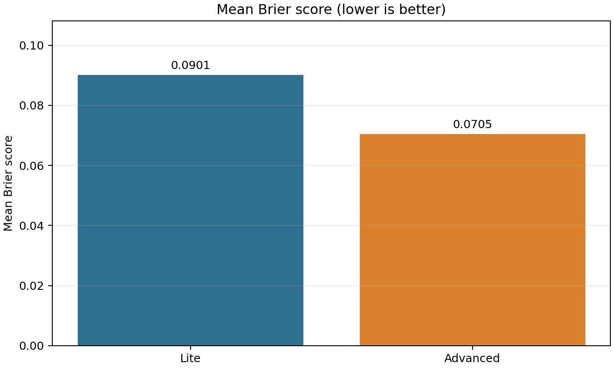
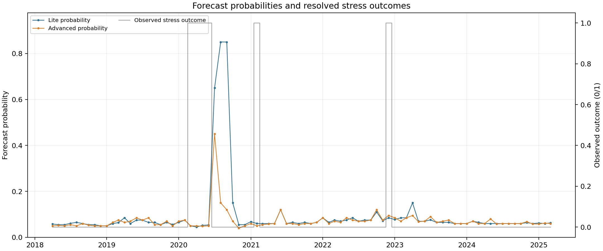
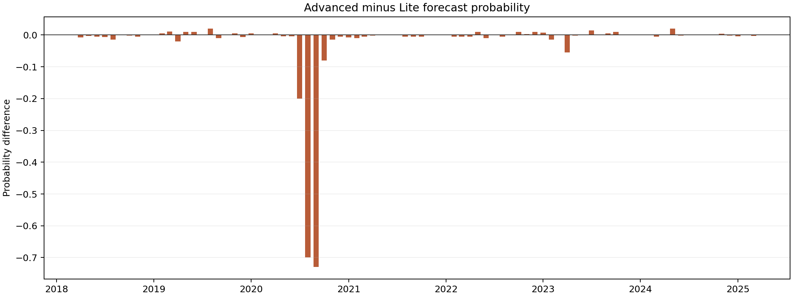
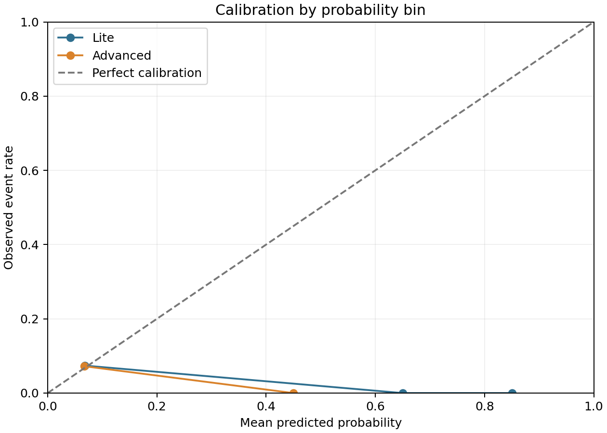

# Manufacturing stress adaptive-model comparison

## Executive summary

This report compares the Lite and Advanced adaptive agents on **84 paired monthly forecast origins**. The lower mean Brier score in this saved historical run was **0.070457** (Advanced). The Advanced-minus-Lite Brier difference was **-0.019690**. Model-stated risk directions matched on **50 of 84 origins (59.5%)**. Direction agreement is a descriptive comparison, not an accuracy measure: the experiment defines no binary decision threshold.

| Model | Model ID | Mean Brier (lower is better) | Scored origins | Skipped origins | Observed stress events |
|---|---|---:|---:|---:|---:|
| Lite          | gemini-3.1-flash-lite-preview |     0.090147 |               84 |                 0 |                        6 |
| Advanced      | gemini-3.5-flash              |     0.070457 |               84 |                 0 |                        6 |

The scores summarize this historical sample only; they do not establish which model will perform better in future periods.

## Experiment

- **Question:** estimate the probability that U.S. manufacturing will be under IPMAN-defined stress three months after each forecast origin.
- **Outcome:** stress is `1` when the three-month IPMAN percentage change is at or below `-2%`; otherwise it is `0`.
- **Origins:** 2018-01-01 through 2024-12-01, monthly stride (1 month); forecast dates run 2018-04-01 through 2025-03-01.
- **Horizon:** 3 months. Since origins are monthly but forecast horizons are three months, adjacent forecast targets overlap.
- **Warm-up:** 60 months, as specified in the saved backtest.
- **Scoring:** binary Brier score, `mean((probability - observed_outcome) ** 2)`; lower is better.
- **Observed events:** 6 of 84 forecast outcomes (7.1%).
- **Mutation:** disabled; both models used the read-only comparison variant.
- **Data source:** cached paired backtest artifacts in `manufacturing_stress_smoke_llmp_v3_14b1deebe4`. Report generation made no LLM calls.
- **Outcome values:** the backtest artifact stores each prediction and its Brier score. The binary outcome in the origin table is recovered from that score and probability, validated against the binary Brier formula, and required to match between the two models.

## Results

The bars above use `tables/model_summary.csv`.

This chart plots both model probabilities and the observed binary outcome by forecast date. Its numeric source is `tables/paired_origin_predictions.csv`.

Positive values indicate a higher Advanced probability; negative values indicate a higher Lite probability. The exact plotted series is the `probability_delta_advanced_minus_lite` column in `tables/paired_origin_predictions.csv`.

The calibration chart compares the mean forecast probability with the observed event rate in each non-empty fixed-width 0.2 probability bin. Exact means, event rates, and counts—including empty bins—are in `tables/calibration_bins.csv`. The observed event count is small, so calibration points are descriptive and uncertain.

## Decision rationale

The origin-level table retains each model's probability, risk direction, concise rationale, supporting evidence, countervailing evidence, per-origin Brier score, and direction-agreement indicator. This is the source for examining how the models reached different or similar assessments; the reported rationale and evidence are model-generated explanations, not independent causal attribution.

## Limitations

- Monthly forecasts share overlapping three-month target windows, so origin-level results are dependent. No independent-observation significance test is reported.
- The event is uncommon in this sample (6/84), limiting the stability of calibration and aggregate comparisons.
- No binary action threshold is defined. The model-stated `up`, `down`, and `neutral` directions are reported verbatim and are not converted into classifications.
- Historical input revisions and release timing are subject to the use case's documented data-cutoff assumptions.

## Included files

- `tables/model_summary.csv` — aggregate scores, scored/skipped counts, event prevalence, and mean forecast probability.
- `tables/paired_origin_predictions.csv` — all paired origin-level numeric values and model rationales/evidence.
- `tables/calibration_bins.csv` — every calibration bin's source values and origin count.
- `run_manifest.json` — cache identifier, specification, artifact timestamps, and chart-to-data mapping.
- `build_report.py` — rebuilds figures and tables from saved cache artifacts without making LLM calls.
