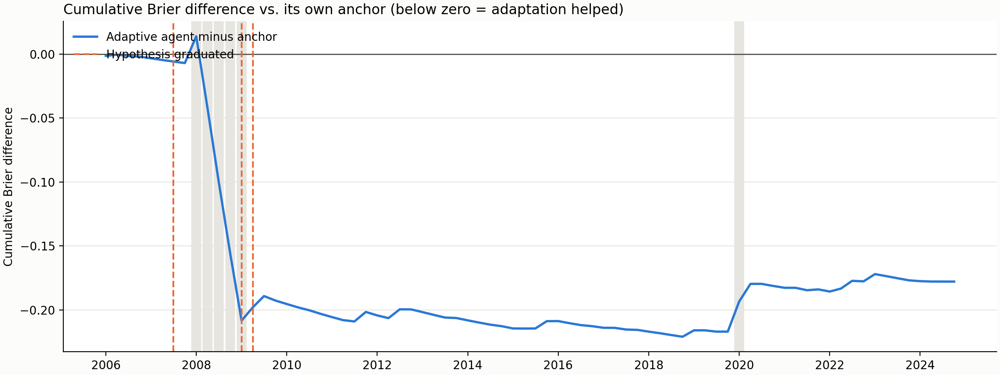

# Manufacturing stress: adaptive agent walk-forward (advanced)

## Summary

The adaptive agent forecast **76 resolved origins** from 2006-01 to
2024-10 in date order, containing **6 stress outcomes**. At each
origin it saw only forecast outcomes already published by then, and its strategy tools refused any hypothesis
outcome that did not cite one of those resolved origins.

Forecast status counts: {'agent': 76}. `fallback_anchor` means both agent attempts failed and the anchor was
used; `dry_run_anchor` means no LLM was called.

| model                |   mean_brier |   brier_skill_vs_baseline |   delta_vs_baseline |   delta_ci_low |   delta_ci_high |   dm_p_value |   reliability |   resolution |
|:---------------------|-------------:|--------------------------:|--------------------:|---------------:|----------------:|-------------:|--------------:|-------------:|
| historical_frequency |       0.0744 |                    0.0000 |              0.0000 |         0.0000 |          0.0000 |     nan      |        0.0002 |       0.0000 |
| adaptive_agent       |       0.0746 |                   -0.0019 |              0.0001 |        -0.0045 |          0.0038 |       0.9521 |        0.0013 |       0.0001 |
| anchor               |       0.0769 |                   -0.0333 |              0.0025 |         0.0010 |          0.0041 |       0.0955 |        0.0009 |       0.0001 |

**Did adaptation beat its own anchor?** Mean Brier difference (agent minus anchor):
-0.00234; Diebold-Mariano statistic -1.51,
p = 0.135. Negative favours the adaptive agent.

## Learning over time

If learning from resolved outcomes helps, the agent-minus-anchor difference should fall from the early to the
late segment.

| segment   | first_origin   | last_origin   |   n_origins |   n_events |   agent_minus_anchor_brier |
|:----------|:---------------|:--------------|------------:|-----------:|---------------------------:|
| early     | 2006-01-01     | 2012-04-01    |          26 |          5 |                   -0.00794 |
| middle    | 2012-07-01     | 2018-07-01    |          25 |          0 |                   -0.00053 |
| late      | 2018-10-01     | 2024-10-01    |          25 |          1 |                   +0.00167 |



## Strategy evolution

Durable mutations by tool:

| tool                      |   mutations |
|:--------------------------|------------:|
| record_observation        |          67 |
| record_hypothesis_outcome |           9 |
| open_hypothesis           |           3 |
| graduate_hypothesis       |           3 |
| update_approach_narrative |           1 |

Hypothesis lifecycle:

| id      | status    |   confirmations |   refutations | claim                                                                                                             |
|:--------|:----------|----------------:|--------------:|:------------------------------------------------------------------------------------------------------------------|
| hyp-001 | confirmed |               3 |             0 | When IPMAN three-month growth is positive, the anchor over-forecasts manufacturing stress.                        |
| hyp-002 | confirmed |               3 |             0 | When three-month stock returns are negative and VIX is elevated, the anchor under-forecasts manufacturing stress. |
| hyp-003 | confirmed |               3 |             0 | When IPMAN three-month decline is greater than 5%, the anchor severely under-forecasts manufacturing stress.      |

### Final learned strategy (`strategy/SKILL.md`)

```markdown
---
name: strategy
description: >-
  Governed adaptive manufacturing-stress forecasting strategy.
---

# Manufacturing Stress Strategy

## Approach

Start from the numerical hybrid anchor and apply upward adjustments when severe IPMAN declines or high financial stress indicate heightened risk. Apply downward adjustments only when short-term IPMAN growth is positive and financial indicators are stable. Rationale: Resolved feedback from recent origins shows the anchor severely under-forecasts stress during periods of negative stock returns, elevated VIX, and deep IPMAN contractions.

## Calibration corrections

| Condition | Adjustment | Source |
|---|---|---|
| When IPMAN three-month growth is positive. | Reduce the forecast probability below the anchor by 0.01 to 0.015. | hyp-001 |
| When three-month stock returns are negative and VIX is elevated. | Increase the forecast probability above the anchor by 0.05 to 0.15. | hyp-002 |
| When IPMAN three-month decline is greater than 5%. | Increase the forecast probability above the anchor by 0.10 to 0.25. | hyp-003 |

## Open hypotheses

*(None.)*

## Observations

- origin-003: Positive short-term IPMAN growth and positive industrial stock returns indicate low near-term risk of manufacturing stress.
- origin-003: In origin-001, IPMAN growth was positive and the resolved outcome was no stress, confirming that a lower forecast than the anchor was accurate.
- origin-005: Strong positive short-term IPMAN growth and low financial stress indicators suggest extremely low risk of manufacturing stress.
- origin-006: Positive three-month IPMAN growth of 0.86% and positive industrial stock returns of 1.44% indicate low risk of manufacturing stress.
- origin-007: Positive three-month IPMAN growth of 1.11% and strong industrial stock returns of 10.96% indicate very low risk of manufacturing stress.
- origin-008: Positive three-month IPMAN growth of 0.17% and positive industrial stock returns of 5.76% indicate low risk of manufacturing stress.
- origin-009: Positive three-month IPMAN growth indicates low stress risk, while negative industrial stock returns and elevated VIX present countervailing concerns.
- origin-010: Negative three-month IPMAN growth of -1.38% and elevated financial stress indicators suggest a heightened risk of manufacturing stress.
- origin-011: In origin-009, three-month stock returns were negative and VIX was elevated, and the outcome was stress (1) while the anchor was only 0.049.
- origin-011: The anchor under-forecasted manufacturing stress in origin-009 when stock returns were negative and VIX was elevated.
- origin-012: Negative three-month IPMAN growth and elevated financial stress indicators preceded a resolved outcome of manufacturing stress in origin-010.
- origin-012: In origin-012, IPMAN three-month decline is -5.75% and the anchor remains extremely low at 0.059 despite severe contraction.
- origin-013: Severe three-month IPMAN contraction exceeding five percent combined with extreme financial stress indicates a very high probability of ongoing manufacturing stress.
- origin-014: The statistical anchor severely under-forecasts manufacturing stress during periods of deep three-month IPMAN contractions and elevated financial stress.
- origin-015: Strong stock market rebounds during deep manufacturing contractions suggest a potential transition phase, but high unemployment and elevated credit spreads keep near-term stress risk high.
- origin-016: In origin-014, despite a deep IPMAN contraction, the manufacturing sector did not enter stress, resulting in a false positive for both the anchor and the adjusted forecast.
- origin-017: Positive three-month industrial production growth and rising stock prices indicate a lower risk of manufacturing stress despite elevated unemployment.
- origin-018: The statistical anchor over-forecasts manufacturing stress during periods of positive short-term industrial production growth and strong equity market returns.
- origin-019: Positive three-month industrial production growth and stabilizing financial indicators in recent origins preceded non-stressed outcomes, confirming the anchor's upward bias under these conditions.
- origin-020: Positive three-month industrial production growth and strong equity returns in recent origins continue to support downward adjustments to the anchor.
- origin-021: Positive three-month industrial production growth and strong equity returns continue to signal low risk of manufacturing stress, justifying downward adjustments to the anchor.
- origin-022: The statistical anchor over-forecasts manufacturing stress when short-term industrial production growth is positive and financial markets are stable.
- origin-023: The statistical anchor over-forecasts manufacturing stress when short-term industrial production growth is positive and financial markets are stable.
- origin-025: Downward adjustments to the anchor when three-month industrial production growth is positive have consistently improved forecast accuracy and reduced Brier scores.
- origin-026: Positive three-month industrial production growth and strong equity returns in origin-024 preceded a non-stressed outcome, confirming low risk.
- origin-027: Positive three-month industrial production growth and stable financial indicators in origin-025 preceded a non-stressed outcome, confirming the downward adjustment.
- origin-028: The statistical anchor has consistently over-forecasted manufacturing stress during periods of stable financial markets and moderate industrial production changes.
- origin-029: Positive three-month industrial production growth and stable financial indicators continue to precede non-stressed outcomes, supporting downward adjustments to the anchor.
- origin-030: Positive three-month industrial production growth and low financial volatility continue to precede non-stressed outcomes, supporting downward adjustments to the anchor.
- origin-031: Downward adjustments to the anchor when three-month industrial production growth is positive continue to improve forecast accuracy.
- origin-032: Strong one-month and six-month industrial production growth combined with positive equity returns suggest low risk of manufacturing stress despite a minor three-month decline.
- origin-033: The statistical anchor continues to over-forecast manufacturing stress when short-term industrial production growth is positive and financial markets are stable.
- origin-034: Positive three-month industrial production growth and stable financial indicators in recent origins continue to precede non-stressed outcomes, supporting downward adjustments.
- origin-036: Stable financial indicators and positive six-month industrial production growth continue to signal low risk of manufacturing stress, justifying a slight downward adjustment to the anchor.
- origin-037: Positive three-month industrial production growth and stable financial indicators in origin-035 preceded a non-stressed outcome, confirming the downward adjustment.
- origin-038: Stable financial indicators and positive short-term industrial production growth continue to precede non-stressed outcomes, supporting the validity of downward adjustments.
- origin-039: Stable financial indicators and positive short-term industrial production growth continue to precede non-stressed outcomes, supporting downward adjustments to the anchor.
- origin-040: Downward adjustments to the anchor when short-term industrial production growth is positive have consistently reduced Brier scores across recent resolved origins.
- origin-041: The statistical anchor remains highly accurate during periods of mild industrial production declines and positive equity returns.
- origin-042: In origin-040, adjusting the forecast upward from the anchor resulted in a higher Brier score as the outcome was no stress.
- origin-043: Positive short-term industrial production growth and stable financial indicators in origin-041 preceded a non-stressed outcome, confirming the low-risk environment.
- origin-044: In origin-042, the statistical anchor over-forecasted manufacturing stress, and a downward adjustment was successful as the outcome was no stress.
- origin-045: In origin-043, the statistical anchor over-forecasted manufacturing stress, and a downward adjustment was successful as the outcome was no stress.
- origin-046: In origin-044, the statistical anchor over-forecasted manufacturing stress, and a downward adjustment was successful as the outcome was no stress.
- origin-047: Positive three-month industrial production growth and stable financial indicators in origin-045 preceded a non-stressed outcome, confirming the downward adjustment.
- origin-048: In origin-046, positive short-term industrial production growth and stable financial indicators preceded a non-stressed outcome.
- origin-049: In origin-047, positive three-month industrial production growth and stable financial indicators preceded a non-stressed outcome, confirming the downward adjustment.
- origin-050: In origin-048, positive three-month industrial production growth and stable financial indicators preceded a non-stressed outcome.
- origin-051: Positive three-month industrial production growth and stable financial indicators in origin-049 preceded a non-stressed outcome, confirming the downward adjustment.
- origin-052: Positive three-month industrial production growth and stable financial indicators continue to precede non-stressed outcomes, supporting downward adjustments to the anchor.
- origin-053: Downward adjustments to the anchor when short-term industrial production growth is positive continue to be validated by non-stressed outcomes.
- origin-054: In origin-052, the anchor over-forecasted manufacturing stress, and a downward adjustment was successful as the outcome was no stress.
- origin-055: In origin-053, adjusting the forecast upward from the anchor resulted in a higher Brier score as the outcome was no stress.
- origin-056: In origin-054, the statistical anchor was highly accurate during a period of mild industrial production decline and stable financial markets.
- origin-057: In origin-055, positive short-term industrial production growth and stable financial indicators preceded a non-stressed outcome, confirming the downward adjustment.
- origin-059: In origin-057, the manufacturing sector experienced stress, resulting in an under-forecast by both the anchor and the adjusted forecast.
- origin-060: In origin-058, the anchor and adjusted forecast both over-forecasted stress during a period of high volatility that resolved to no stress.
- origin-061: In origin-059, the statistical anchor and adjusted forecast were highly aligned and accurately predicted a non-stressed outcome.
- origin-062: In origin-060, the statistical anchor over-forecasted manufacturing stress, and a downward adjustment was successful as the outcome was no stress.
- origin-063: Positive short-term industrial production growth and stable financial indicators in recent resolved origins continue to precede non-stressed outcomes, supporting downward adjustments to the anchor.
- origin-064: In origin-062, the statistical anchor was highly accurate during a period of mild industrial production decline and stable financial markets.
- origin-065: In origin-063, positive short-term industrial production growth and stable financial indicators preceded a non-stressed outcome, confirming the downward adjustment.
- origin-066: In origin-064, the statistical anchor was highly accurate and the outcome was no stress, confirming stable conditions.
- origin-068: Negative stock returns and elevated VIX in recent origins did not lead to manufacturing stress, suggesting the anchor remains reliable under these conditions.
- origin-069: In origin-067, the statistical anchor remained low and the outcome was no stress, confirming that mild contractions do not always lead to persistent manufacturing stress.
- origin-070: Negative stock returns and elevated VIX in origin-068 did not lead to manufacturing stress, confirming that the anchor remains reliable under these conditions.
- origin-071: Positive three-month industrial production growth and stable financial indicators continue to precede non-stressed outcomes, supporting downward adjustments to the anchor.
- origin-072: Downward adjustments to the anchor during periods of positive short-term industrial production growth continue to improve forecast accuracy.
- origin-074: In origin-072, a downward adjustment from the anchor was successful as the outcome was no stress.
- origin-076: Recent resolved outcomes confirm that the statistical anchor remains highly accurate during periods of mild industrial production declines and stable financial markets.
```

## Notes

- Origins are spaced 3 month(s) apart; with a
  three-month stride, consecutive targets do not overlap, so the Diebold-Mariano test uses no HAC lags.
- Prompts anonymise dates and origins are referred to by ids, but a modern LLM may still recognise a historical
  episode from its signals. This is a retrospective pseudo-out-of-sample study.
- Every strategy mutation is in `strategy/.history/adaptation_audit.jsonl`, stamped with the origin id at which
  it was made.
