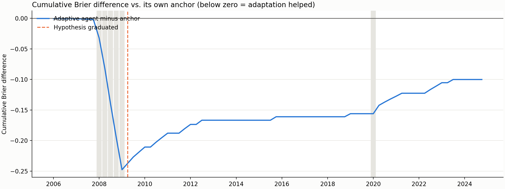

# Manufacturing stress: adaptive agent walk-forward (lite)

## Summary

The adaptive agent forecast **76 resolved origins** from 2006-01 to
2024-10 in date order, containing **6 stress outcomes**. At each
origin it saw only forecast outcomes already published by then, and its strategy tools refused any hypothesis
outcome that did not cite one of those resolved origins.

Forecast status counts: {'agent': 76}. `fallback_anchor` means both agent attempts failed and the anchor was
used; `dry_run_anchor` means no LLM was called.

| model                |   mean_brier |   brier_skill_vs_baseline |   delta_vs_baseline |   delta_ci_low |   delta_ci_high |   dm_p_value |   reliability |   resolution |
|:---------------------|-------------:|--------------------------:|--------------------:|---------------:|----------------:|-------------:|--------------:|-------------:|
| historical_frequency |       0.0744 |                    0.0000 |              0.0000 |         0.0000 |          0.0000 |     nan      |        0.0002 |       0.0000 |
| adaptive_agent       |       0.0756 |                   -0.0156 |              0.0012 |        -0.0043 |          0.0054 |       0.6143 |        0.0028 |       0.0004 |
| anchor               |       0.0769 |                   -0.0333 |              0.0025 |         0.0010 |          0.0041 |       0.0955 |        0.0009 |       0.0001 |

**Did adaptation beat its own anchor?** Mean Brier difference (agent minus anchor):
-0.00132; Diebold-Mariano statistic -0.85,
p = 0.396. Negative favours the adaptive agent.

## Learning over time

If learning from resolved outcomes helps, the agent-minus-anchor difference should fall from the early to the
late segment.

| segment   | first_origin   | last_origin   |   n_origins |   n_events |   agent_minus_anchor_brier |
|:----------|:---------------|:--------------|------------:|-----------:|---------------------------:|
| early     | 2006-01-01     | 2012-04-01    |          26 |          5 |                   -0.00668 |
| middle    | 2012-07-01     | 2018-07-01    |          25 |          0 |                   +0.00050 |
| late      | 2018-10-01     | 2024-10-01    |          25 |          1 |                   +0.00244 |



## Strategy evolution

24 reviews ran; 0 failed; 35 strategy mutations came from reviews. Most recent reviews:

| origin_id   |   mutations | reply                                                                                                                                                                                                                                                              |
|:------------|------------:|:-------------------------------------------------------------------------------------------------------------------------------------------------------------------------------------------------------------------------------------------------------------------|
| origin-052  |           1 | The strategy performed identically to the anchor on the four newly resolved origins, as none of the conditions for the existing calibration correction were met.                                                                                                   |
| origin-056  |           2 | The strategy performed identically to the anchor on the four newly resolved origins, as the calibration correction was only triggered at origin-053, which resulted in a non-stress outcome.                                                                       |
| origin-059  |           1 | The strategy performed identically to the anchor on the three newly resolved origins, as the calibration correction was not triggered in any of these cases.                                                                                                       |
| origin-060  |           1 | The strategy's calibration correction for high credit spreads and VIX levels was applied at origin-058, but the outcome was non-stress, resulting in a higher Brier score than the anchor.                                                                         |
| origin-064  |           1 | The strategy's calibration correction for high credit spreads and VIX levels was applied across the four newly resolved origins, all of which were non-stress periods, resulting in higher Brier scores compared to the anchor.                                    |
| origin-068  |           1 | The strategy's existing calibration correction for high credit spreads and VIX levels was reviewed against the four newly resolved origins, where it correctly remained inactive as the conditions were not met, resulting in performance identical to the anchor. |
| origin-072  |           2 | The strategy's calibration correction for high credit spreads and VIX levels was applied at three of the four newly resolved origins, but as all outcomes were non-stress, the strategy underperformed the anchor in terms of Brier scores.                        |
| origin-076  |           2 | The strategy's calibration correction was incorrectly applied at origin-071 because the VIX condition was not met, resulting in a higher Brier score than the anchor for that period.                                                                              |

Durable mutations by tool:

| tool                      |   mutations |
|:--------------------------|------------:|
| record_observation        |          30 |
| record_hypothesis_outcome |           3 |
| open_hypothesis           |           1 |
| graduate_hypothesis       |           1 |

Hypothesis lifecycle:

| id      | status    |   confirmations |   refutations | claim                                                                                      |
|:--------|:----------|----------------:|--------------:|:-------------------------------------------------------------------------------------------|
| hyp-001 | confirmed |               3 |             0 | When CREDIT_SPREAD is above 2.0 and VIXCLS is above 20, the anchor under-forecasts stress. |

### Final learned strategy (`strategy/SKILL.md`)

```markdown
---
name: strategy
description: >-
  Governed adaptive manufacturing-stress forecasting strategy.
---

# Manufacturing Stress Strategy

## Approach

Start from the numerical hybrid anchor and make only bounded, evidence-backed adjustments.

## Calibration corrections

| Condition | Adjustment | Source |
|---|---|---|
| CREDIT_SPREAD > 2.0 and VIXCLS > 20 | +0.03 | hyp-001 |

## Open hypotheses

*(None.)*

## Observations

- origin-004: The strategy performed slightly better than the anchor on the two newly resolved origins, though both were non-stress periods.
- origin-008: The strategy maintained a lower mean Brier score than the anchor across the six resolved origins, all of which were non-stress periods.
- origin-011: origin-009
- origin-011: The strategy correctly identified the stress event at origin-009 better than the anchor, though both models significantly under-forecasted the probability of the event.
- origin-012: The strategy correctly identified the stress event at origin-010, outperforming the anchor, and providing a second confirmation for the hypothesis that high credit spreads and VIX levels indicate under-forecasting of stress.
- origin-013: The strategy correctly identified the stress event at origin-011, outperforming the anchor, and providing a third confirmation for the hypothesis that high credit spreads and VIX levels indicate under-forecasting of stress.
- origin-014: The strategy successfully identified the stress event at origin-012, providing a fourth confirmation for the hypothesis that high credit spreads and VIX levels indicate under-forecasting of stress, leading to the graduation of this hypothesis into a formal calibration correction.
- origin-015: The strategy continued to outperform the anchor on the newly resolved stress event at origin-013, maintaining its lower mean Brier score.
- origin-016: The strategy correctly identified the non-stress outcome at origin-014, though it slightly underperformed the anchor in terms of Brier score due to the higher probability assigned to stress.
- origin-020: The strategy's calibration correction for high credit spreads and VIX levels continued to be applied correctly across the newly resolved origins, though it resulted in higher Brier scores during non-stress periods compared to the anchor.
- origin-024: The strategy's calibration correction for high credit spreads and VIX levels continued to be applied correctly across the newly resolved origins, though it resulted in higher Brier scores during non-stress periods compared to the anchor.
- origin-028: The strategy's calibration correction for high credit spreads and VIX levels was applied at origin-024, confirming the hypothesis, though it resulted in a higher Brier score during this non-stress period compared to the anchor.
- origin-028: The strategy continued to apply the calibration correction for high credit spreads and VIX levels across the newly resolved origins, though it resulted in higher Brier scores during non-stress periods compared to the anchor.
- origin-032: The strategy's calibration correction for high credit spreads and VIX levels was applied at origin-027, but the outcome was non-stress, and the correction was not triggered at the other three newly resolved origins, which were also non-stress periods.
- origin-032: The strategy's calibration correction for high credit spreads and VIX levels was applied at origin-027, but the outcome was non-stress, and the correction was not triggered at the other three newly resolved origins, which were also non-stress periods.
- origin-036: The strategy correctly identified the non-stress outcomes at the four newly resolved origins, matching the anchor's performance as the calibration correction was not triggered.
- origin-040: The strategy performed identically to the anchor on the four newly resolved origins, as none of the conditions for the existing calibration correction were met.
- origin-044: The strategy correctly applied the calibration correction at origin-040, though the outcome was non-stress, and performed identically to the anchor at the other three newly resolved origins where the correction was not triggered.
- origin-044: The strategy performed identically to the anchor on the four newly resolved origins, as the calibration correction was only triggered at origin-040, which resulted in a non-stress outcome.
- origin-048: The strategy performed identically to the anchor on the four newly resolved origins, as none of the conditions for the existing calibration correction were met.
- origin-052: The strategy performed identically to the anchor on the four newly resolved origins, as none of the conditions for the existing calibration correction were met.
- origin-056: The strategy correctly applied the calibration correction at origin-053, though the outcome was non-stress, and performed identically to the anchor at the other three newly resolved origins where the correction was not triggered.
- origin-056: The strategy performed identically to the anchor on the four newly resolved origins, as the calibration correction was only triggered at origin-053, which resulted in a non-stress outcome.
- origin-059: The strategy performed identically to the anchor on the three newly resolved origins, as the calibration correction was not triggered in any of these cases.
- origin-060: The strategy correctly applied the calibration correction at origin-058, but the outcome was non-stress, resulting in a higher Brier score than the anchor.
- origin-064: The strategy's calibration correction for high credit spreads and VIX levels was applied across the four newly resolved origins, all of which were non-stress periods, resulting in higher Brier scores compared to the anchor.
- origin-068: The strategy performed identically to the anchor on the four newly resolved origins, as none of the conditions for the existing calibration correction were met.
- origin-072: The calibration correction for high credit spreads and VIX levels was applied at three of the four newly resolved origins, but all resulted in non-stress outcomes, leading to higher Brier scores than the anchor.
- origin-072: The calibration correction for high credit spreads and VIX levels continues to be applied correctly when conditions are met, though it has consistently resulted in higher Brier scores during recent non-stress periods compared to the anchor.
- origin-076: The strategy's calibration correction for high credit spreads and VIX levels was incorrectly triggered at origin-071, where the VIX was below 20, leading to a higher Brier score than the anchor during this non-stress period.
- origin-076: The strategy's calibration correction for high credit spreads and VIX levels was incorrectly triggered at origin-071, where the VIX was below 20, leading to a higher Brier score than the anchor during this non-stress period.
```

## Notes

- Origins are spaced 3 month(s) apart; with a
  three-month stride, consecutive targets do not overlap, so the Diebold-Mariano test uses no HAC lags.
- Prompts anonymise dates and origins are referred to by ids, but a modern LLM may still recognise a historical
  episode from its signals. This is a retrospective pseudo-out-of-sample study.
- Every strategy mutation is in `strategy/.history/adaptation_audit.jsonl`, stamped with the origin id at which
  it was made.
