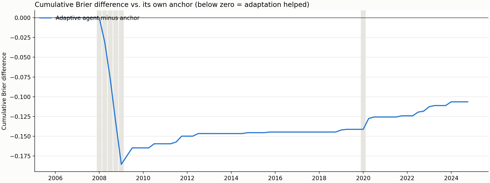

# Manufacturing stress: adaptive agent walk-forward (lite)

## Summary

The adaptive agent forecast **76 resolved origins** from 2006-01 to
2024-10 in date order, containing **6 stress outcomes**. At each
origin it saw only forecast outcomes already published by then, and its strategy tools refused any hypothesis
outcome that did not cite one of those resolved origins.

Forecast status counts: {'agent': 76}. `fallback_anchor` means both agent attempts failed and the anchor was
used; `dry_run_anchor` means no LLM was called.

| model                |   mean_brier |   brier_skill_vs_baseline |   delta_vs_baseline |   delta_ci_low |   delta_ci_high |   dm_p_value |   reliability |   resolution |
|:---------------------|-------------:|--------------------------:|--------------------:|---------------:|----------------:|-------------:|--------------:|-------------:|
| historical_frequency |       0.0744 |                    0.0000 |              0.0000 |         0.0000 |          0.0000 |     nan      |        0.0002 |       0.0000 |
| adaptive_agent       |       0.0755 |                   -0.0145 |              0.0011 |        -0.0031 |          0.0044 |       0.6197 |        0.0016 |       0.0001 |
| anchor               |       0.0769 |                   -0.0333 |              0.0025 |         0.0010 |          0.0041 |       0.0955 |        0.0009 |       0.0001 |

**Did adaptation beat its own anchor?** Mean Brier difference (agent minus anchor):
-0.00140; Diebold-Mariano statistic -1.09,
p = 0.279. Negative favours the adaptive agent.

## Learning over time

If learning from resolved outcomes helps, the agent-minus-anchor difference should fall from the early to the
late segment.

| segment   | first_origin   | last_origin   |   n_origins |   n_events |   agent_minus_anchor_brier |
|:----------|:---------------|:--------------|------------:|-----------:|---------------------------:|
| early     | 2006-01-01     | 2012-04-01    |          26 |          5 |                   -0.00576 |
| middle    | 2012-07-01     | 2018-07-01    |          25 |          0 |                   +0.00021 |
| late      | 2018-10-01     | 2024-10-01    |          25 |          1 |                   +0.00153 |



## Strategy evolution

Durable mutations by tool:

*(No mutations.)*

*(No hypotheses opened.)*

### Final learned strategy (`strategy/SKILL.md`)

```markdown
---
name: strategy
description: >-
  Governed adaptive manufacturing-stress forecasting strategy.
---

# Manufacturing Stress Strategy

## Approach

Start from the numerical hybrid anchor and make only bounded, evidence-backed adjustments.

## Calibration corrections

*(None graduated.)*

## Open hypotheses

*(None.)*

## Observations

*(None.)*
```

## Notes

- Origins are spaced 3 month(s) apart; with a
  three-month stride, consecutive targets do not overlap, so the Diebold-Mariano test uses no HAC lags.
- Prompts anonymise dates and origins are referred to by ids, but a modern LLM may still recognise a historical
  episode from its signals. This is a retrospective pseudo-out-of-sample study.
- Every strategy mutation is in `strategy/.history/adaptation_audit.jsonl`, stamped with the origin id at which
  it was made.
