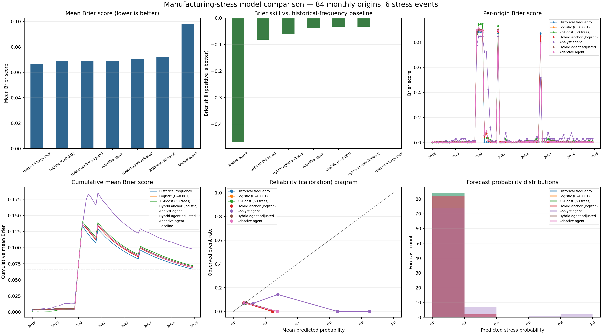
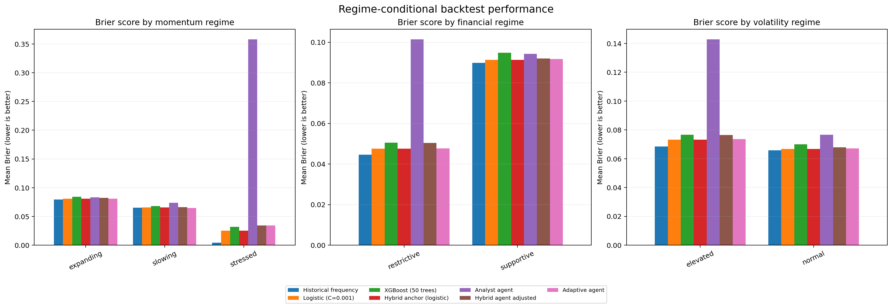
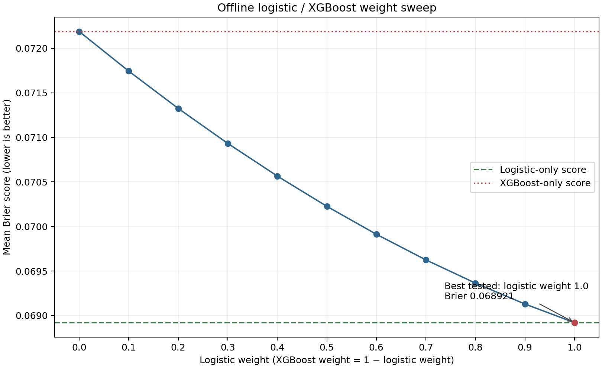
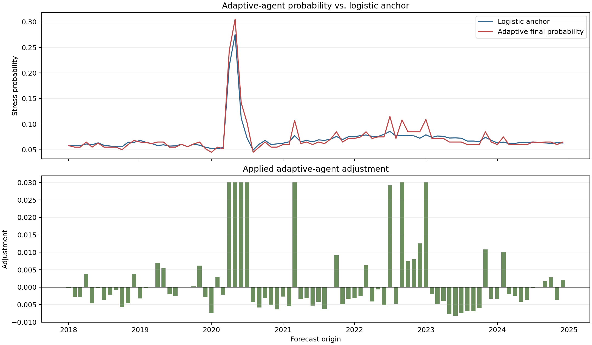

# Manufacturing stress: all-model comparison

## Executive summary

This report consolidates the saved outputs from `manufacturing_stress_workbench_2.ipynb`.
It compares seven forecasting methods on the same **84 monthly forecast origins** from
**2018-01-01 through 2024-12-01**. There were **6 observed stress events**
(7.1%); all models scored every origin with no skipped forecasts.

The historical-frequency baseline had the lowest mean Brier score (**0.066693**).
All model Brier skills relative to that baseline were non-positive. The result is descriptive,
not evidence that any model is statistically inferior: six positive events provide limited
information for a rare-event comparison.

## Experiment

- **Task:** estimate the probability that U.S. manufacturing is under IPMAN-defined stress three
  months after each forecast origin.
- **Outcome:** a resolved month is positive when IPMAN has fallen by at least 2% over the
  preceding three months (percentage change is at or below −2%).
- **Evaluation window:** `2018-01-01` to `2024-12-01` origins,
  monthly stride `1`, with a three-month forecast horizon and `60`-month
  warm-up. The first/last scored forecast dates are 2018-04-01 and 2025-03-01.
- **Scoring:** Brier score, the mean squared difference between the forecast probability and
  binary outcome. Lower is better. Brier skill is `1 − model score / baseline score`; positive
  values beat historical frequency.
- **Inputs:** FRED series IPMAN, FEDFUNDS, DGS10, DGS2, CPIAUCSL, UNRATE, ICSA, VIXCLS, and
  BAA10Y; Yahoo Finance adjusted-close histories for SPY and XLI. Derived features include
  1-, 3-, and 6-month IPMAN changes; the federal-funds rate and 10-year-minus-2-year spread;
  CPI level and year-over-year change; unemployment, initial claims, VIX, credit spread; and
  3-/12-month SPY and XLI returns.
- **Cutoff handling:** model features are limited to observations released by each origin.
  Because the FRED adapter does not provide historical release vintages, IPMAN observations use a
  conservative one-month release lag.
- **Input handling:** the saved run used existing FRED and market-data caches (`refresh_input_data`
  was `False`). All three agent options were enabled. Their saved YAML
  results were reused here; this report build did not issue LLM calls. Deterministic methods were
  recomputed locally from the same cached input data and checked against the notebook's saved
  comparison table.
- **Regime diagnostics:** momentum, financial-condition, and volatility labels were reconstructed
  at each origin using only data released by that cutoff. They are descriptive slices; they did
  not retune the models.
- **Hybrid weight sweep:** this is an offline calculation over the already-scored logistic and
  XGBoost probabilities. It is not a fitted model and does not change the active logistic-only
  anchor.

## Methods compared

| model_label | description |
|---|---|
| Historical frequency | Expanding historical event frequency; the Brier-score reference baseline. |
| Logistic (C=0.001) | Fit-at-origin logistic regression (C=0.001) using cutoff-safe IPMAN, macroeconomic, and market features. |
| Hybrid anchor (logistic) | Deterministic anchor; logistic-only, not a 50/50 blend. |
| Adaptive agent | Stateful LLM agent using the logistic anchor and persisted strategy; its adjustment is bounded to ±0.03. |
| Hybrid agent adjusted | LLM-proposed probability adjusted from the logistic anchor, with the change bounded to ±0.03. |
| XGBoost (50 trees) | XGBoost with 50 trees, max depth 2, learning rate 0.03, min_child_weight 3, and reg_lambda 5. |
| Analyst agent | LLM analyst forecast from cutoff-safe evidence and historical event rate. |

## Overall results

| model_label | mean_brier | scored_origins | skipped_origins | delta_vs_baseline | brier_skill_vs_baseline |
|---|---|---|---|---|---|
| Historical frequency | 0.066693 | 84 | 0 | 0.000000 | 0.0000 |
| Logistic (C=0.001) | 0.068921 | 84 | 0 | 0.002229 | -0.0334 |
| Hybrid anchor (logistic) | 0.068921 | 84 | 0 | 0.002229 | -0.0334 |
| Adaptive agent | 0.069205 | 84 | 0 | 0.002512 | -0.0377 |
| Hybrid agent adjusted | 0.070689 | 84 | 0 | 0.003997 | -0.0599 |
| XGBoost (50 trees) | 0.072189 | 84 | 0 | 0.005496 | -0.0824 |
| Analyst agent | 0.097926 | 84 | 0 | 0.031234 | -0.4683 |

`hybrid_anchor` is intentionally identical to logistic regression because the active anchor is
logistic-only. The agent rows report the final probability used for scoring; their proposal,
anchor, applied adjustment, evidence, and trace references (where present) are included in the
origin-level CSV.

## Regime results

The event counts below add to six within each regime dimension; a forecast origin is counted once
in each separate dimension.

| regime_dimension | regime | origins | stress_events | observed_event_rate |
|---|---|---|---|---|
| momentum_regime | expanding | 35 | 3.0 | 8.6% |
| momentum_regime | slowing | 43 | 3.0 | 7.0% |
| momentum_regime | stressed | 6 | 0.0 | 0.0% |
| financial_regime | restrictive | 43 | 2.0 | 4.7% |
| financial_regime | supportive | 41 | 4.0 | 9.8% |
| volatility_regime | elevated | 27 | 2.0 | 7.4% |
| volatility_regime | normal | 57 | 4.0 | 7.0% |

The full regime-conditional score and calibration diagnostics are in
[`tables/regime_conditional_brier.csv`](tables/regime_conditional_brier.csv). Regimes with few
origins/events should not be treated as stable performance rankings.

## Offline hybrid weight sweep

Weight 1.0 is pure logistic and weight 0.0 is pure XGBoost. The best tested point was logistic
weight **1.0** (mean Brier **0.068921**),
which is the logistic-only endpoint. No tested blend beat logistic-only or the historical-frequency
baseline. The sweep is exploratory and does not change the configured anchor.

| logistic_weight | xgboost_weight | mean_brier | delta_vs_logistic | delta_vs_xgboost |
|---|---|---|---|---|
| 0.0 | 1.0 | 0.072189 | 0.003267 | 0.000000 |
| 0.1 | 0.9 | 0.071744 | 0.002822 | -0.000445 |
| 0.2 | 0.8 | 0.071325 | 0.002404 | -0.000864 |
| 0.3 | 0.7 | 0.070932 | 0.002011 | -0.001256 |
| 0.4 | 0.6 | 0.070566 | 0.001645 | -0.001623 |
| 0.5 | 0.5 | 0.070226 | 0.001305 | -0.001962 |
| 0.6 | 0.4 | 0.069913 | 0.000991 | -0.002276 |
| 0.7 | 0.3 | 0.069625 | 0.000704 | -0.002563 |
| 0.8 | 0.2 | 0.069364 | 0.000443 | -0.002824 |
| 0.9 | 0.1 | 0.069130 | 0.000208 | -0.003059 |
| 1.0 | 0.0 | 0.068921 | 0.000000 | -0.003267 |

## Adaptive-agent adjustments

Across 84 origins, the adaptive agent's mean applied adjustment was
+0.00155; it adjusted upward on 26
origins and downward on 58; it made no adjustment on
0 origins. 7 proposals were clamped by the ±0.03 adjustment bound. These are descriptive outputs,
not proof that adaptation improved accuracy.

## Figures and interpretation

### All-model diagnostics

The panels show mean Brier, Brier skill against baseline, per-origin Brier, cumulative Brier,
reliability, and probability distributions. The reliability and histogram panels use five
probability bins. Because the event is rare, these plots are sensitive to the small number of
positive outcomes.

### Regime-conditional Brier scores

Each panel compares models within one cutoff-safe regime dimension. The number of origins and
events for each group is reported in `tables/regime_origin_counts.csv`.

### Hybrid weight sweep

This plot varies only the logistic/XGBoost blend weight over the saved forecasts. It is not an
additional backtest.

### Adaptive-agent probability and adjustment

The upper panel compares the logistic anchor and adaptive final probability; the lower panel shows
the applied adjustment at each origin.

## Data files

- [`tables/model_comparison.csv`](tables/model_comparison.csv): aggregate model metrics.
- [`tables/origin_level_predictions.csv`](tables/origin_level_predictions.csv): long-format,
  84-origin by seven-model results with probabilities, outcomes, scores, agent evidence, and
  available Langfuse trace references.
- [`tables/origin_level_probabilities_wide.csv`](tables/origin_level_probabilities_wide.csv):
  compact one-row-per-origin comparison.
- [`tables/regime_origin_counts.csv`](tables/regime_origin_counts.csv): cases, events, and event
  rates by regime.
- [`tables/regime_conditional_brier.csv`](tables/regime_conditional_brier.csv): conditional model
  score and calibration metrics.
- [`tables/hybrid_weight_sweep.csv`](tables/hybrid_weight_sweep.csv): all eleven tested weights.
- [`tables/calibration_bins.csv`](tables/calibration_bins.csv) and
  [`tables/probability_distribution_bins.csv`](tables/probability_distribution_bins.csv): data
  behind the calibration and probability-distribution panels.
- [`tables/adaptive_agent_adjustments.csv`](tables/adaptive_agent_adjustments.csv): summary of the
  adaptive agent's anchor, proposal, applied adjustments, and clamping.

## Limitations

This is a development backtest, not a protected holdout or a causal evaluation of adaptation.
Origins advance monthly while the target horizon is three months, so adjacent outcomes overlap.
There are only six positive events, which limits calibration and regime-level conclusions.
Model comparisons should be treated as exploratory pending a larger, untouched evaluation set.

## Rebuilding this package

Run `python reports/compare_all/build_report.py` from the repository root. The script requires the
saved agent-result YAML files and cached input data. It loads agent artifacts and runs only local
deterministic predictors; it does not call the LLM services or refresh external data.
