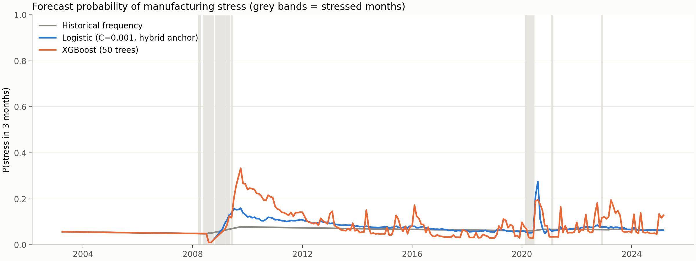
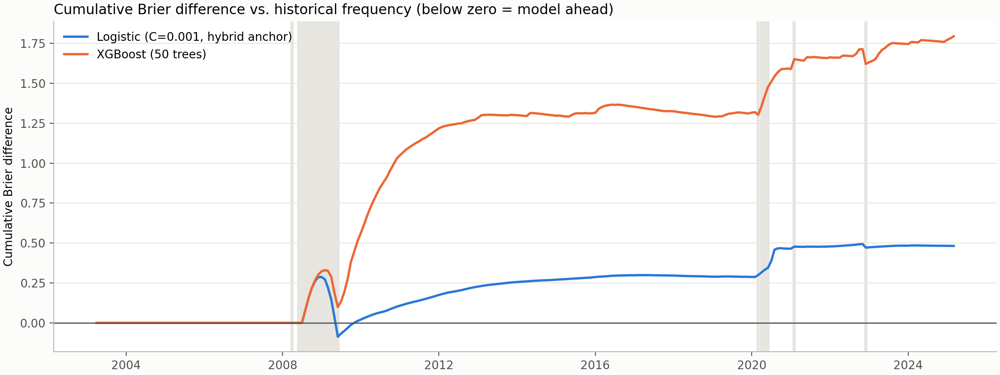
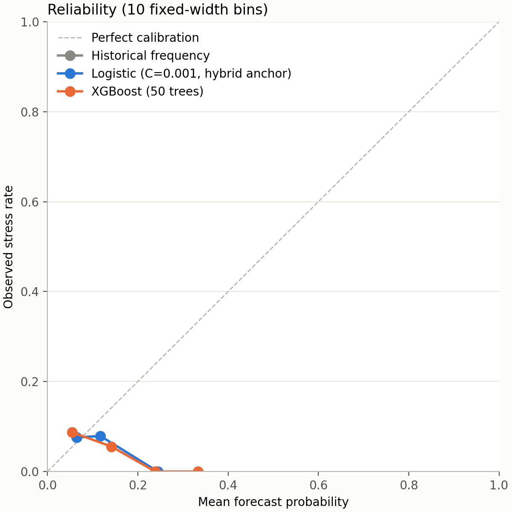

# Manufacturing stress: full-history evaluation

## Executive summary

This package evaluates the deterministic forecasters on **264 monthly origins** from
**2003-01 through 2024-12**, which contain **20 stressed
forecast months** in **5 distinct episodes**. The 2018-2024 comparison window had 6.

The lowest mean Brier score was **Historical frequency (0.0710)**. Each model is
compared with historical frequency using a circular block bootstrap (block length 6, 90% interval) and a
Diebold-Mariano test whose variance allows for the overlap created by a 3-month horizon on monthly
origins. A negative difference means the model beat the baseline.

| model_label                       |   mean_brier |   brier_skill_vs_baseline |   delta_vs_baseline | delta_90pct_ci     |   prob_better_than_baseline |   dm_p_value |
|:----------------------------------|-------------:|--------------------------:|--------------------:|:-------------------|----------------------------:|-------------:|
| Historical frequency              |       0.0710 |                    0.0000 |              0.0000 | [+0.0000, +0.0000] |                    nan      |     nan      |
| Logistic (C=0.001, hybrid anchor) |       0.0728 |                   -0.0257 |              0.0018 | [-0.0008, +0.0043] |                      0.1220 |       0.2072 |
| XGBoost (50 trees)                |       0.0778 |                   -0.0957 |              0.0068 | [+0.0034, +0.0108] |                      0.0000 |       0.0006 |

## Sub-periods

The logistic and XGBoost hyperparameters were selected on chronological folds inside 2000-2017, so the
2003-2017 rows are not out-of-sample with respect to that choice. The 2018-2024 rows are after the tuning
period, but that window had already been inspected during development.

| period                                           | model                               |   n_events |   mean_brier |   brier_skill_vs_baseline |   delta_ci_low |   delta_ci_high |   dm_p_value |
|:-------------------------------------------------|:------------------------------------|-----------:|-------------:|--------------------------:|---------------:|----------------:|-------------:|
| 2003-2017 (overlaps hyperparameter tuning folds) | historical_frequency                |         14 |       0.0730 |                    0.0000 |         0.0000 |          0.0000 |     nan      |
| 2003-2017 (overlaps hyperparameter tuning folds) | logistic_c_0_001                    |         14 |       0.0746 |                   -0.0224 |        -0.0021 |          0.0051 |       0.4166 |
| 2003-2017 (overlaps hyperparameter tuning folds) | xgb_50_depth2_lr0_03_minchild3_l2_5 |         14 |       0.0803 |                   -0.1004 |         0.0026 |          0.0128 |       0.0059 |
| 2018-2024 (after tuning period)                  | historical_frequency                |          6 |       0.0667 |                    0.0000 |         0.0000 |          0.0000 |     nan      |
| 2018-2024 (after tuning period)                  | logistic_c_0_001                    |          6 |       0.0689 |                   -0.0334 |         0.0000 |          0.0053 |       0.1434 |
| 2018-2024 (after tuning period)                  | xgb_50_depth2_lr0_03_minchild3_l2_5 |          6 |       0.0724 |                   -0.0849 |         0.0017 |          0.0105 |       0.0292 |

## Calibration and discrimination (Murphy decomposition)

`reliability` is miscalibration (lower is better); `resolution` is the ability to separate stressed from
calm periods (higher is better); `uncertainty` depends only on the outcomes. Historical frequency has almost
no resolution by construction, so any model that beats it must earn resolution without paying for it in
reliability.

| model                               |   mean_brier |   reliability |   resolution |   uncertainty |
|:------------------------------------|-------------:|--------------:|-------------:|--------------:|
| historical_frequency                |      0.07100 |       0.00014 |      0.00000 |       0.07002 |
| logistic_c_0_001                    |      0.07282 |       0.00076 |      0.00004 |       0.07002 |
| xgb_50_depth2_lr0_03_minchild3_l2_5 |      0.07780 |       0.00574 |      0.00051 |       0.07002 |

## Did any model see the episodes coming?

Mean probability over the three origins immediately before each episode's first stressed forecast month.

| first_stressed_forecast_date   | last_stressed_forecast_date   |   stressed_months |   lead: Historical frequency |   lead: Logistic (C=0.001, hybrid anchor) |   lead: XGBoost (50 trees) |
|:-------------------------------|:------------------------------|------------------:|-----------------------------:|------------------------------------------:|---------------------------:|
| 2008-04-01                     | 2008-04-01                    |                 1 |                        0.049 |                                     0.049 |                      0.049 |
| 2008-06-01                     | 2009-06-01                    |                13 |                        0.049 |                                     0.049 |                      0.049 |
| 2020-03-01                     | 2020-06-01                    |                 4 |                        0.061 |                                     0.059 |                      0.069 |
| 2021-02-01                     | 2021-02-01                    |                 1 |                        0.067 |                                     0.059 |                      0.067 |
| 2022-12-01                     | 2022-12-01                    |                 1 |                        0.066 |                                     0.081 |                      0.132 |

## Agents on 2018-2024, with uncertainty

The saved all-model comparison (`reports/compare_all/`) ranks seven methods on 84 monthly origins with 6 stress events. Applying the same statistics to those saved probabilities (no new LLM calls):

| model_label                       |   mean_brier |   brier_skill_vs_baseline |   delta_vs_baseline | delta_90pct_ci     |   prob_better_than_baseline |   dm_p_value |
|:----------------------------------|-------------:|--------------------------:|--------------------:|:-------------------|----------------------------:|-------------:|
| Historical frequency              |       0.0667 |                    0.0000 |              0.0000 | [+0.0000, +0.0000] |                    nan      |     nan      |
| Hybrid anchor (logistic)          |       0.0689 |                   -0.0334 |              0.0022 | [+0.0000, +0.0053] |                      0.0474 |       0.1434 |
| Logistic (C=0.001, hybrid anchor) |       0.0689 |                   -0.0334 |              0.0022 | [+0.0000, +0.0053] |                      0.0474 |       0.1434 |
| Adaptive agent                    |       0.0692 |                   -0.0377 |              0.0025 | [-0.0009, +0.0067] |                      0.1354 |       0.2487 |
| Hybrid agent adjusted             |       0.0707 |                   -0.0599 |              0.0040 | [+0.0012, +0.0074] |                      0.0050 |       0.0388 |
| XGBoost (50 trees)                |       0.0722 |                   -0.0824 |              0.0055 | [+0.0015, +0.0104] |                      0.0026 |       0.0309 |
| Analyst agent                     |       0.0979 |                   -0.4683 |              0.0312 | [+0.0055, +0.0666] |                      0.0088 |       0.1128 |

Every interval that contains zero means the data cannot distinguish that model from the base rate. Treat the point-estimate ranking in `compare_all` accordingly.

## Figures







## Method notes

- Same harness, task, target, and cutoff rules as the smoke backtest; only the window is longer
  (`specs/manufacturing_stress_full_history.yaml`).
- Every predictor is refit at each origin on cutoff-safe training rows. IPMAN uses a one-month release lag;
  FRED values are latest-vintage rather than point-in-time (ALFRED) vintages.
- Brier differences on overlapping horizons are serially dependent. The block bootstrap and HAC-adjusted
  Diebold-Mariano test account for that; an i.i.d. test would overstate significance.

## Limitations

The episodes are few and clustered, so even this longer window supports wide intervals. Hyperparameters
were tuned on part of this history. A clean out-of-sample test needs prospectively recorded forecasts.

## Rebuilding

```bash
uv run --directory implementations python -m manufacturing_stress_forecasting.run_full_history
```

Runs locally from the cached FRED and Yahoo Finance data in a few minutes; makes no LLM calls.
