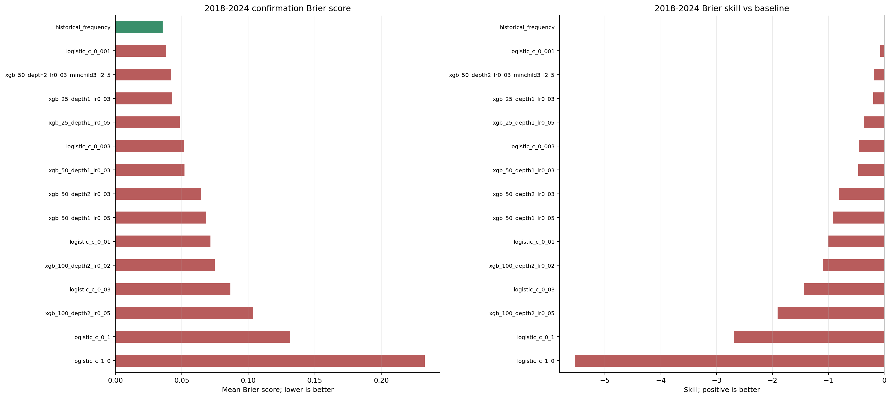
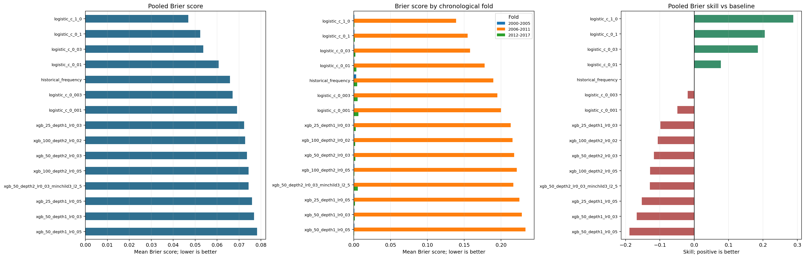

# Manufacturing Stress Parameter Sweep Report

## Executive Summary

This report evaluates statistical forecasting candidates for the binary `manufacturing_stress` target. The target represents a manufacturing stress episode defined from a trailing three-month decline in industrial production. The forecast horizon is three monthly periods.

The sweep found that the logistic candidate with `C=1.0` had the best pooled Brier score. However, the result is provisional because only five stress events occurred across the tuning period and they appeared in only one of the three evaluation folds. No XGBoost candidate improved on the historical-frequency baseline in pooled Brier score.

## Evaluation Approach

The experiment uses rolling-origin, chronological backtesting. At each forecast origin, the model is trained only on information available up to that origin, then evaluated on the future three-month horizon. This prevents future observations from entering the training data for an earlier forecast.

The tuning period is divided into three folds:

- 2000-2005
- 2006-2011
- 2012-2017

The backtest stride is three months. Each candidate produces 72 scored forecast origins, with no skipped origins.

The primary metric is the Brier score:

$$
\mathrm{Brier} = \frac{1}{N}\sum_{i=1}^{N}(p_i-y_i)^2
$$

where $p_i$ is the predicted probability and $y_i$ is the observed binary outcome. Lower values are better. Brier skill is measured relative to the historical-frequency baseline.

## Models Evaluated

The sweep evaluated 15 models in total:

- 1 historical-frequency baseline
- 6 logistic-regression candidates with different regularization strengths
- 8 XGBoost candidates using shallow trees, conservative learning rates, and additional regularization settings

The XGBoost parameter expansion included `min_child_weight` and `reg_lambda`.

## Results

| Candidate | Mean Brier | Brier skill | Folds beating baseline | Event folds | Interpretation |
|---|---:|---:|---:|---:|---|
| `logistic_c_1_0` | 0.0468 | +28.8% | 3 | 1 | Best overall; provisional |
| `logistic_c_0_1` | 0.0523 | +20.5% | 3 | 1 | Strong logistic alternative |
| `logistic_c_0_03` | 0.0537 | +18.5% | 3 | 1 | Strong logistic alternative |
| `historical_frequency` | 0.0658 | 0.0% | 0 | 1 | Baseline |
| `xgb_25_depth1_lr0_03` | 0.0723 | -9.8% | 2 | 1 | Best XGBoost, but below baseline |
| `xgb_100_depth2_lr0_02` | 0.0728 | -10.6% | 2 | 1 | Below baseline |
| `xgb_50_depth2_lr0_03` | 0.0736 | -11.7% | 2 | 1 | Below baseline |
| `xgb_50_depth2_lr0_03_minchild3_l2_5` | 0.0743 | -12.9% | 1 | 1 | Stronger regularization did not help |

The best XGBoost candidate still had a higher Brier score than the historical-frequency baseline. This means the new XGBoost settings should not be promoted based on this sweep.

## Interpretation

The automatic tuning rule selected `logistic_c_1_0` because it improved pooled Brier score, beat the baseline in all three folds, and improved on the event-bearing fold. That selection is useful as a development signal, but it is not conclusive evidence of generalization.

The main limitation is event scarcity. Only five stress events occurred across all 72 forecast origins, and all events were concentrated in one fold. The apparently strong performance in the event-free folds can largely reflect conservative low probabilities rather than demonstrated event discrimination.

The 2018-2024 window has already been inspected and therefore is not an untouched confirmation set. It should not be used to select or retune the candidate.

## Historical Confirmation Diagnostic: 2018-2024

For completeness, the baseline and all 14 swept candidates were also evaluated on the fixed 2018-2024 window. This is a historical diagnostic only, not a protected confirmation evaluation. The run used the same three-month forecast horizon and stride of three months. Each model produced 28 scored origins with no skipped origins.

| Candidate | Mean Brier | Brier skill vs baseline |
|---|---:|---:|
| `historical_frequency` | 0.0356 | 0.0% |
| `logistic_c_0_001` | 0.0380 | -6.7% |
| `xgb_50_depth2_lr0_03_minchild3_l2_5` | 0.0422 | -18.4% |
| `xgb_25_depth1_lr0_03` | 0.0426 | -19.7% |
| `xgb_25_depth1_lr0_05` | 0.0485 | -36.2% |
| `logistic_c_0_003` | 0.0516 | -45.0% |
| `xgb_50_depth1_lr0_03` | 0.0521 | -46.3% |
| `xgb_50_depth2_lr0_03` | 0.0643 | -80.7% |
| `xgb_50_depth1_lr0_05` | 0.0682 | -91.5% |
| `logistic_c_0.01` | 0.0716 | -101.0% |
| `xgb_100_depth2_lr0_02` | 0.0749 | -110.3% |
| `logistic_c_0.03` | 0.0866 | -143.2% |
| `xgb_100_depth2_lr0_05` | 0.1036 | -191.0% |
| `logistic_c_0.1` | 0.1314 | -269.1% |
| `logistic_c_1.0` | 0.2327 | -553.7% |

The historical-frequency baseline ranked first. The tuning winner, `logistic_c_1_0`, ranked last in this diagnostic. The selected development configuration is now `logistic_c_0_001` with `xgb_50_depth2_lr0_03_minchild3_l2_5`; these are operational choices for the fixed workbench, not a claim that either model outperforms the baseline.

The machine-readable exports are available in [`confirmation_2018_2024_results.csv`](confirmation_2018_2024_results.csv) and [`confirmation_2018_2024_results.md`](confirmation_2018_2024_results.md).

The corresponding confirmation plots are available in [`confirmation_2018_2024_results.png`](confirmation_2018_2024_results.png):

## Recommendation

1. Use `logistic_c_0_001` as the selected logistic candidate.
2. Use `xgb_50_depth2_lr0_03_minchild3_l2_5` as the selected XGBoost candidate.
3. Use the logistic prediction alone as the hybrid numerical anchor.
4. Keep the historical-frequency model as the benchmark; it still ranked first in the inspected confirmation diagnostic.
5. Treat the selected configuration as frozen for a fresh prospective evaluation, without claiming confirmation superiority.
6. Revisit model selection when more stress events are available across multiple chronological folds.

## Reproducing the Plot

Run the parameter-sweep notebook through the comparison cell, then run the plotting cell. The plotting cell produces three views:

1. Pooled Brier score by candidate.
2. Brier score across the three chronological folds.
3. Pooled Brier skill relative to historical frequency.

The exported figure is saved as `parameter_sweep_results.png` in this report directory.

## Scope and Caveats

This is a historical tuning analysis, not a protected prospective evaluation. The results describe calibration and probabilistic accuracy under the selected historical backtest design. They do not establish that the provisional logistic candidate will outperform the baseline in future data.
